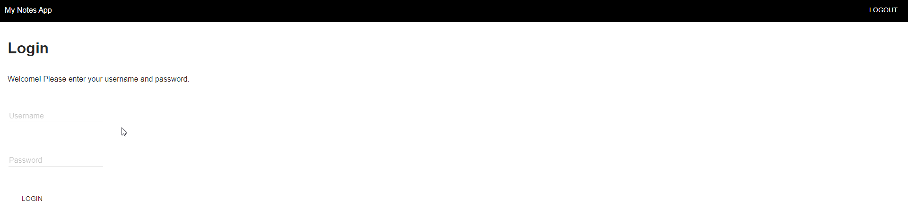
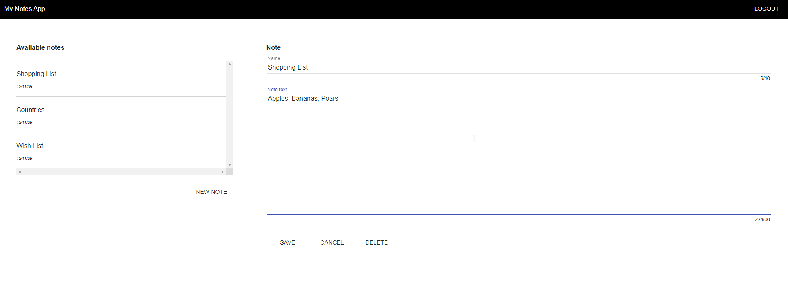

# Note taking app

## Screenshots

### Login 

### Notes 

## Implemented
 * All items required in the feedback from the PO 
 * All CRUD functionality

## I would implement with more time
 * Error handling, frontend and backend
 * Unit tests, frontend and backend
 * Integration tests

### Non-MVP items (Nice to haves) 
 * Upload images/videos and attachments
 * Implement collections of notes (e.g. work, school, personal)
 * Search function
 * Website export functionality
 * Probably persist the note database to a file 